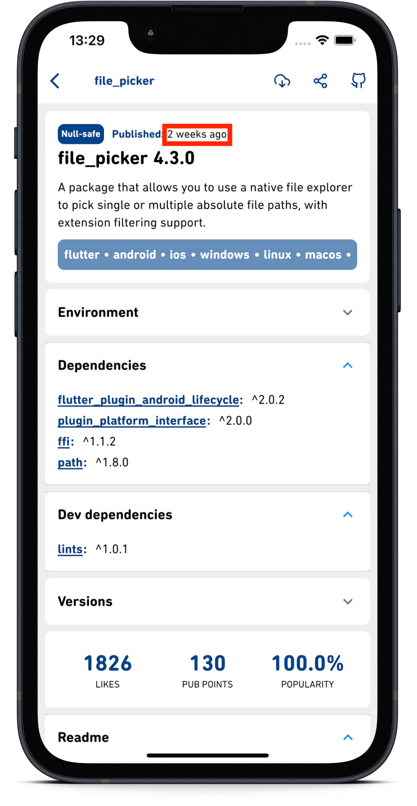

# timed

Calculates the time interval between two dates in seconds, minutes, days, weeks, months, or years.

**Note:** if the interval is longer than 2 years it will return to that of the informed

## Installation

```yaml
dev_dependencies:
  timed: ^0.0.1
```

## Usage

```dart
var result = Timed.get(to: DateTime(2022, 05, 01));  
```
or 

```dart

var to = DateTime(2022, 05, 01);
var from = DateTime(2022, 12, 01);

var result = Timed.get(to: to, from: from);  
```

or 

```dart
var result = DateTime.now().toTimed;
```

This returns a ```Map<String,dynamic>```, the keys to this map are ```seconds```, ```second```, ```minutes```, ```minute```,```hours```, ```hour```, ```days```, ```day```, ```weeks```, ```week```, ```months```, ```month```, ```years```, ```year``` and ```date```.

**Note**: ```{weeks: 2}``` In this map the key to use in [my translation resource](https://pub.dev/packages/gen_i18n) and the value, ready is the value 😅😎

```date``` is the key returned when it is not possible to estimate the time

That was one of the tactics used in the project [pub.dev](https://github.com/srnunio/flutter_pub_dev)

<p float="left">
   
</p>

# Support

You liked this package? then give it a star. If you want to help then:

* Start this repository
* Send a Pull Request with new features
* Share this package